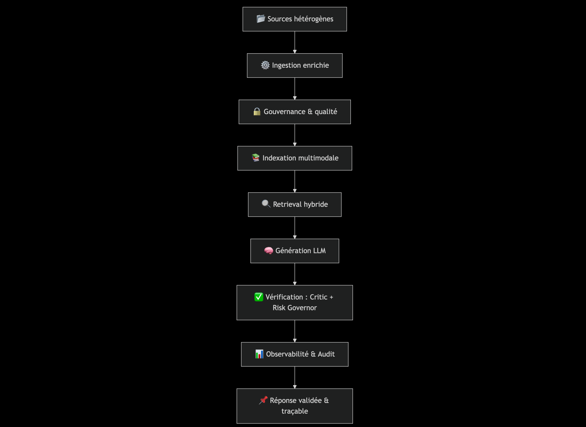
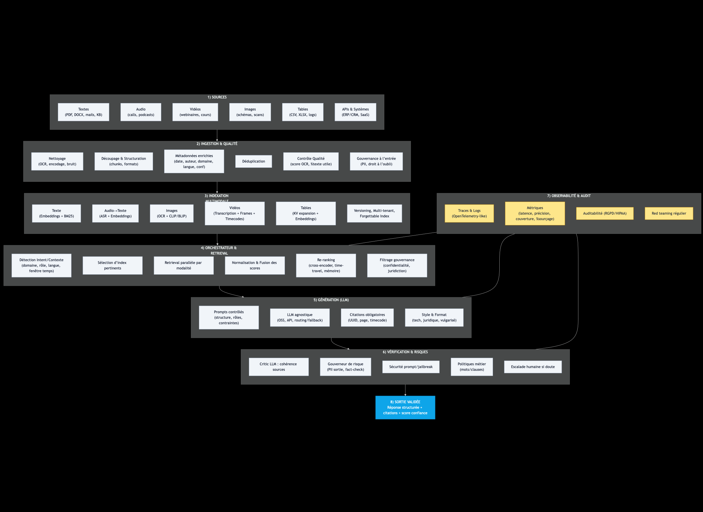
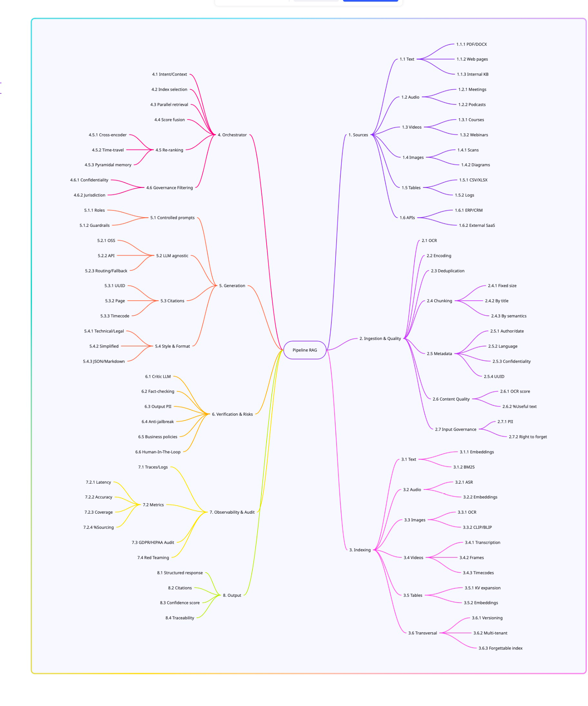

# 📎 Annexes : Mode d’emploi opérationnel du pipeline RAG

---

## Annexe A : I/O et vision multimodale

---

# 🧩 Schéma du pipeline RAG modulaire & antifragile 



---


# 🧩 Pipeline RAG modulaire & antifragile : Vue complète



```text
[ 1. SOURCES ]
 📄 Textes : PDF, DOCX, mails, bases internes
 🎧 Audio : calls, podcasts, conférences
 🎥 Vidéos : tutos, webinaires, captations
 🖼️ Images : schémas, photos, scans
 📊 Tables : CSV, Excel, logs
 🌐 APIs : données externes, contextes métier

       │
       ▼

[ 2. INGESTION & QUALITÉ ]
 🔹 Nettoyage : OCR, encodage, suppression bruit
 🔹 Structuration : découpage en chunks, formats homogènes
 🔹 Métadonnées :
    - date, auteur, domaine, version
    - langue, juridiction, confidentialité
    - UUID unique
 🔹 Déduplication automatique
 🔹 Contrôle qualité (score OCR, % texte utile)
 🔹 Gouvernance dès l’ingestion (PII filter, droit à l’oubli)

       │
       ▼

[ 3. INDEXATION MULTIMODALE ]
 ⚙️ Index séparés par modalité (multi-index) :
   - Texte → embeddings + BM25
   - Audio → transcription (ASR) + embeddings
   - Images → OCR + embeddings visuels (CLIP/BLIP)
   - Vidéos → transcription audio + frames + timecodes
   - Tables → expansion clé-valeur + embeddings
 🔹 Index “forgettable” (suppression sélective)
 🔹 Versioning natif
 🔹 Multi-tenant (cloisonnement des données)

       │
       ▼

[ 4. ORCHESTRATEUR ]
 🎼 Chef d’orchestre du pipeline :
   - Détection intent & contexte (domaine, langue, rôle, contrainte temporelle)
   - Sélection des index pertinents
   - Retrieval parallèle (par modalité)
   - Normalisation des scores
   - Pondération dynamique (ex. droit → texte > image)
   - Filtrage gouvernance (confidentialité, langue, validité)
   - Re-ranking (cross-encoder, time-travel retrieval, mémoire pyramidale)

       │
       ▼

[ 5. GÉNÉRATION (LLM) ]
 🧠 LLM agnostique (open source ou API)
 🔹 Prompts contrôlés (structure, contexte)
 🔹 Citations obligatoires (UUID, page, timecode)
 🔹 Adaptation style (technique, juridique, vulgarisé)
 🔹 Options : multi-LLM (rapide vs précis) / fallback

       │
       ▼

[ 6. VÉRIFICATION ]
 🔍 Critic LLM : vérifie cohérence avec les sources
 🛡 Gouverneur de risque :
   - PII filter (sortie)
   - Fact-check (comparaison avec retrieval)
   - Jailbreak defense (prompt injection)
   - Politiques métier (mots interdits, clauses légales)
 🔹 Escalade humaine si doute (human-in-the-loop)

       │
       ▼

[ 7. OBSERVABILITÉ & AUDIT ]
 📊 Logs & traces (OpenTelemetry-like)
 📈 Métriques :
   - Latence par modalité
   - Précision retrieval
   - Taux de couverture documentaire
   - % réponses sourcées
 🔹 Auditabilité complète (RGPD, HIPAA)
 🔹 Red teaming régulier (tests adversariaux)

       │
       ▼

[ 8. SORTIE VALIDÉE ]
 ✅ Réponse claire, structurée, sourcée
 ✅ Citations & extraits multimodaux (textes, images, timecodes vidéo)
 ✅ Scores de confiance
 ✅ Traçabilité complète (audit trail)
 ✅ Conformité (confidentialité respectée)
 ✅ Souveraineté (on-prem / cloud hybride)


```

### 🧭 Lecture rapide
- Sources → diversité et hétérogénéité (texte, image, audio, vidéo, tables).
- Ingestion → nettoyage, structuration, métadonnées, gouvernance dès l’entrée.
- Indexation multimodale → bases séparées par modalité (multi-index antifragile).
- Orchestrateur → fusionne, normalise, applique gouvernance.
- Génération → LLM agnostique, prompts contrôlés, citations obligatoires.
- Vérification → critic LLM + gouverneur de risque.
- Observabilité → logs, métriques, audits, red teaming.
- Sortie → réponse validée, traçable, souveraine.

---
🧩 carte mentale




### Explication simplifiée

##### 1. Sources (où viennent les données)
- **Texte** : documents PDF, Word, pages web, base de connaissances interne.  
- **Audio** : réunions, podcasts.  
- **Vidéos** : cours, webinaires.  
- **Images** : scans, diagrammes.  
- **Tables** : fichiers Excel, bases de données.  
- **APIs** : ERP/CRM, SaaS externes.  

Ça liste tous les types de contenus qu’on peut brancher.

---

##### 2. Ingestion & Qualité (préparer les données)
- **OCR** : reconnaissance de texte dans les images.  
- **Encodage** : transformer en format lisible.  
- **Déduplication** : éviter les doublons.  
- **Chunking** : découper en morceaux (par taille, par titre, par sens).  
- **Métadonnées** : ajouter auteur, langue, confidentialité, identifiant unique.  
- **Qualité du contenu** : mesurer si le texte est lisible et utile.  
- **Gouvernance** : droit à l’oubli, gestion des PII (données personnelles).  

Bref, nettoyer et structurer avant de stocker.

---

##### 3. Indexing (comment retrouver les données)
- **Texte** : embeddings (vecteurs), bases spécialisées.  
- **Audio** : transcription, embeddings.  
- **Images** : OCR, embeddings.  
- **Vidéos** : découpe en frames, timecodes.  
- **Tables** : expansion des colonnes, embeddings.  
- **Transversal** : versioning, multi-tenant (multi-clients), index oubliables.  

L’index est comme un gros catalogue intelligent pour retrouver vite l’info.

---

##### 4. Orchestrator (cerveau de la recherche)
- Comprendre l’intention de la question.  
- Choisir l’index approprié.  
- Faire de la recherche parallèle.  
- Fusionner et classer les résultats.  
- **Re-ranking** (réorganiser avec cross-encoder).  
- **Mémoires spéciales** : time travel, pyramid memory.  
- **Gouvernance** : filtrer les résultats selon les règles.  

C’est le chef d’orchestre qui décide quoi chercher et comment combiner.

---

##### 5. Generation (l’IA qui répond)
- **Prompts contrôlés**.  
- **LLM agnostique** (pas bloqué sur un seul modèle).  
- **Routage/fallback** (plan B si un modèle échoue).  
- **Citations, timecodes, formats spécifiques** (JSON, Markdown, légal, simplifié).  

Ici, l’IA rédige la réponse en respectant des règles.

---

##### 6. Verification & Risks (sécurité et vérification)
- **Fact-checking**.  
- **Détection d’informations personnelles**.  
- **Filtrage des contenus dangereux**.  
- **Politiques métier**.  
- **Humain dans la boucle** (validation manuelle possible).  

C’est la partie pour éviter les réponses fausses ou risquées.

---

##### 7. Observability & Audit (suivi et contrôle)
- Mesurer **latence, précision, couverture, ressources**.  
- Rapports **RGPD/HIPAA**.  
- **Red teaming** (tester les failles de sécurité).  

Comme un tableau de bord qualité et conformité.

---

##### 8. Output (ce qui est renvoyé à l’utilisateur)
- **Réponse structurée**.  
- **Citations des sources**.  
- **Score de confiance**.  
- **Traçabilité**.  

L’utilisateur reçoit une réponse claire, avec preuves et transparence.

---

## ✅ En résumé
Cette carte décrit **tout le cycle de vie d’un RAG** :

1. On prend des données variées →  
2. On les prépare et nettoie →  
3. On les indexe →  
4. On orchestre la recherche →  
5. On génère une réponse →  
6. On vérifie les risques →  
7. On audite et mesure →  
8. On livre une réponse fiable à l’utilisateur.  


---

### A.1 Vue globale I/O

```text
Utilisateur / Systèmes → [ Entrées ]
 (texte, image, audio, vidéo, PDF, API, contexte métier)
             │
             ▼
        [ ORCHESTRATEUR ]
     - Détection d’intent & contexte
     - Sélection des index pertinents
     - Gouvernance (rôles, PII, confidentialité)
             │
             ▼
       [ Retrieval & Fusion ]
             │
             ▼
       [ Génération (LLM) ]
             │
             ▼
 [ Critic + Gouverneur de risque ]
             │
             ▼
         Réponse validée
```

### A.2 Séquence end-to-end

1. Entrée (question, doc, audio, vidéo)  
2. Ingestion & normalisation  
3. Indexation multimodale (texte, audio, image, vidéo, tables)  
4. Retrieval hybride (vecteurs + BM25 + time-travel)  
5. Génération LLM (citations obligatoires)  
6. Critic LLM (validation)  
7. Gouverneur de risque (policies, PII, conformité)  
8. Réponse validée + audit trail  

### A.3 Formats JSON type

**QueryEnvelope**
```json
{
  "query": "Quels étaient les protocoles COVID en 2020 ?",
  "user": {"role": "medecin", "lang": "fr"},
  "constraints": {"date": "2020-05-01", "confidentiality": "medical"}
}
```

**RetrievalResponse**
```json
{
  "docs": [
    {"text": "Protocole HAS 2020", "source": "pdf-123", "date": "2020-04-30"},
    {"text": "OMS guidance", "source": "who-2020", "date": "2020-05-01"}
  ]
}
```

**AuditEvent**
```json
{
  "request_id": "uuid",
  "user_id": "hash",
  "ts": "2025-09-03T10:15:22Z",
  "retrieval": {"topk": 8, "scores": [0.83, 0.79], "namespace": "legal"},
  "generation": {"model": "LLM-X", "prompt_id": "tmpl-12"},
  "verification": {"critic_pass": true, "policy_blocks": []},
  "citations": [{"doc_id": "D123", "chunk_id": "C9", "ver": "1.7"}]
}
```

---

## Annexe B : Schémas récapitulatifs & pipeline détaillé

### B.1 Pipeline global (vue d’ensemble)

```text
[ Entrées ]
   │
   ▼
[ Ingestion & Normalisation ]
   │
   ▼
[ Indexation sécurisée ] ──► [ Stockage (Hot/Cold) ]
   │
   ▼
[ Retrieval Hybride ] ──► [ Fusion & Re-ranking ]
   │
   ▼
[ Génération (LLM) + Prompts contrôlés ]
   │
   ▼
[ Vérification (Critic) + Gouverneur de risque ]
   │
   ▼
[ Réponse validée ] ──► [ Observabilité / Audit / Feedback ]
```

### B.2 Étape 1 : Ingestion & normalisation

```text
[ Sources brutes ]
  ├─ PDF / DOCX / HTML
  ├─ Images (scans) / Vidéos
  ├─ Audio / Podcasts
  └─ APIs / Bases métiers
        │
        ▼
[ Ingestion ]
  ├─ OCR / ASR / Parsing
  ├─ Nettoyage & déduplication
  ├─ Enrichissement (métadonnées)
  └─ PII Filter (amont)
```

### B.3 Étape 2 : Indexation & stockage

```text
[ Chunks + Métadonnées ]
        │
        ├─► [ Index BM25 ]
        ├─► [ Index Vectoriel ]
        └─► [ Graph/Relations (option) ]
        │
        ▼
[ Stockage ]
  ├─ Hot: index + embeddings + cache
  └─ Cold: originaux chiffrés + logs ingestion
```

### B.4 Étape 3 : Retrieval (sélection candidates)

```text
[ Requête enrichie ]
    │
    ├─► Recherche BM25 (top_k1)
    ├─► Recherche vectorielle (top_k2)
    └─► Filtres (namespace, date, tags)
    │
    ▼
[ Union de candidats ]
```

### B.5 Étape 4 : Fusion & re-ranking

```text
[ Candidats (K1 + K2) ]
    │
    ├─► Normalisation des scores (0-1)
    ├─► Re-ranking (cross-encoder)
    └─► Diversification (MMR)
    │
    ▼
[ Top N final + Citations ]
```

### B.6 Étape 5 : Génération (prompts contrôlés)

```text
[ Contexte Top N + Instructions ]
    │
    ├─► Templates de prompts
    ├─► Mode "citations obligatoires"
    └─► Multi-LLM (fallback / routing)
    │
    ▼
[ Réponse provisoire + Citations ]
```

### B.7 Étape 6 : Vérification (critic)

```text
[ Réponse provisoire ]
    │
    ├─► Critic LLM (cohérence, contradictions)
    └─► Cross-check citations (couverture, exactitude)
    │
    ▼
[ Réponse revue ]
```

### B.8 Étape 7 : Gouverneur de risque (policies)

```text
[ Réponse revue ]
    │
    ├─► Détection PII / secrets
    ├─► Règles métier (santé/droit)
    ├─► Jailbreak / prompt injection
    └─► Décisions: allow | block | reformulate | escalate
    │
    ▼
[ Réponse validée ]
```

### B.9 Étape 8 : Observabilité, audit & boucles de feedback

```text
[ Événements ]
  ├─ Logs techniques (latence, erreurs)
  ├─ Qualité (faithfulness, coverage)
  ├─ Coûts (tokens, stockage)
  ├─ Sécurité (PII blocks, jailbreaks)
  └─ Feedback utilisateurs (CSAT, votes)
        │
        ▼
[ Dashboards + Alertes ]  →  [ Améliorations: prompts, index, policies ]
```

### B.10 Étape 9 : Réponse & post-traitement

```text
[ Réponse validée ]
   │
   ├─► Formatage (citations, références)
   ├─► Internationalisation (i18n)
   └─► Redaction mode (résumé, pas-à-pas, liste)
   │
   ▼
[ Livraison (UI, API, webhook) ]
```

---

## Annexe C : Checklists pratiques

### C.1 Qualité des données
- [ ] OCR appliqué correctement  
- [ ] Déduplication effectuée  
- [ ] Encodage uniforme (UTF-8)  
- [ ] Taux de texte exploitable > 90 %  
- [ ] Métadonnées minimales présentes  
- [ ] Version du document identifiée  

### C.2 Gouvernance
- [ ] Filtrage PII actif (amont + aval)  
- [ ] Droit à l’oubli (UUID, purge sélective)  
- [ ] Cloisonnement multi-tenant  
- [ ] Journalisation/audit complet  
- [ ] Escalade humaine prévue  

### C.3 Fusion multimodale
- [ ] Index séparés par modalité  
- [ ] Scores normalisés (0-1)  
- [ ] Re-ranking validé (tests offline)  
- [ ] Fallback si modalité indisponible  

### C.4 Performance & coûts
- [ ] Caching embeddings/réponses  
- [ ] k dynamique au retrieval  
- [ ] Batching re-ranking/embeddings  
- [ ] SLO latence p95 défini  
- [ ] Budget LLM suivi (€/req)  

### C.5 Déploiement
- [ ] Canary / Blue-Green  
- [ ] Migration d’index (double écriture)  
- [ ] Rollback transactionnel (prompts/policies)  
- [ ] Feature flags par module  

---

## Annexe D : Outils open source

| Outil                                 | Points forts              | Limites                            |
| ------------------------------------- | ------------------------- | ---------------------------------- |
| LangChain                             | Intégrations multiples    | Spaghetti code, peu de gouvernance |
| LlamaIndex                            | Structuration & ingestion | Scalabilité variable en prod       |
| Haystack                              | Retrieval robuste         | Moins modulable côté génération    |
| RAGFlow / Flowise                     | Low-code visuel           | Gouvernance limitée                |
| Weaviate / Milvus / Qdrant            | Scalables                 | Orchestration externe requise      |
| Presidio / spaCy NER                  | Détection PII             | FPs/FNs à calibrer                 |
| GuardrailsAI / NeMo Guardrails        | Politiques IA             | Couverture des cas à enrichir      |
| OpenTelemetry / MLflow / W&B          | Observabilité & MLOps     | Intégration à soigner              |

---

## Annexe E : Évaluation & métriques

| Catégorie   | Métrique                | Cible prod               |
| ----------- | ----------------------- | ------------------------ |
| Qualité     | Faithfulness            | > 95 %                   |
|             | Citation coverage       | > 90 %                   |
| Retrieval   | Recall@K                | > 85 %                   |
|             | nDCG@K                  | > 0.75                   |
| Performance | Latence p95             | < 3 s                    |
|             | Disponibilité           | > 99.5 %                 |
| Gouvernance | PII leakage             | 0 %                      |
|             | Audit trail             | 100 % des réponses       |
| Coûts       | € par requête (p95)     | < seuil défini           |
| UX          | Trust score (CSAT)      | > 8/10                   |


---

### Comment mesurer ?
- **Faithfulness** : échantillonnage aléatoire, double annotation humaine, seuil d’acceptation (≥90%). 
- **Citation coverage** : calculer la proportion de réponses contenant ≥1 source valide et vérifier la pertinence contextuelle.
- **Retrieval** : constituer un jeu de vérité (gold set), mesurer recall@K et nDCG@K.
- **Process** : réévaluer régulièrement (hebdomadaire) sur un échantillon représentatif pour détecter les dérives.


## Annexe F : Red teaming

- Attaques : prompt injection, data poisoning, jailbreak, exfiltration PII.  
- Rôles : red team (attaque), blue team (défense), purple team (coordination).  
- Gouvernance : règles d’engagement, données synthétiques, validation légale, *kill switch*.  

---

## Annexe G : Stratégies de stockage

- **Hot storage** : chunks + embeddings + index (opérationnel).  
- **Cold storage** : originaux chiffrés + logs d’ingestion (probatoire).  
- Gouvernance : droit à l’oubli, purge sélective, traçabilité, rétention par TTL.  

---

## Annexe H : Bonnes pratiques de déploiement

- **Canary / Blue-Green** : limiter l’impact d’une régression.  
- **Migrations d’index** : double écriture + vérification croisée.  
- **SLO/SLA** : p95 latence, couverture citations, % réponses bloquées par policies.  
- **Alerting** : coûts, dérives qualité, fuites PII, erreurs outliers.  
- **Runbooks** : procédures de rollback et d’escalade.  

---

## Annexe I : Glossaire visuel

- 🎼 **Orchestrateur** → chef d’orchestre du pipeline.  
- 🤖 **LLM** → générateur encadré.  
- 🧐 **Critic LLM** → contrôleur logique.  
- 🔐 **Gouverneur de risque** → gardien conformité.  
- 📄 **Chunk** → morceau documentaire + métadonnées.  
- 🔥 **Hot storage** / ❄️ **Cold storage**.  
- 🌐 **Multi-index multimodal**.  
- ⏳ **Time-travel retrieval**.  
- 🧠 **Mémoire pyramidale**.  

---

## Annexe J : Templates de configuration (YAML)

### J.1 Pipeline minimal modulaire
```yaml
pipeline:
  ingestion:
    ocr: true
    dedup: true
    metadata: ["title","author","date","lang","version"]
    pii_filter: ["presidio","regex"]
  indexing:
    bm25: {enabled: true}
    vectors:
      provider: "sentence-transformers/all-MiniLM-L6-v2"
      dim: 384
    namespaces: ["public","legal","medical"]
  retrieval:
    topk_bm25: 8
    topk_vectors: 8
    rerank: {enabled: true, model: "cross-encoder/ms-marco-MiniLM-L-6-v2"}
  generation:
    model_router:
      - match: "legal"
        model: "LLM-legal-medium"
      - match: "default"
        model: "LLM-general"
    prompts:
      citations_required: true
  verification:
    critic_llm: "LLM-critic"
    citation_check: true
  governance:
    risk_governor:
      pii_block: true
      jailbreak_detection: true
      decisions: ["allow","block","reformulate","escalate"]
  observability:
    tracing: "opentelemetry"
    metrics: ["latency_ms","tokens","pii_blocks","faithfulness"]
```

### J.2 Politiques de sécurité (risk governor)
```yaml
policies:
  pii:
    ssn: "block"
    medical_record: "block"
    email: "reformulate"
  domains:
    health_advice:
      allow_only_sources: ["has","who","ansm"]
      fallback_on_missing_sources: "escalate"
  jailbreak:
    patterns: ["ignore previous", "disregard", "system prompt"]
    action: "block"
```

### J.3 Observabilité & alertes
```yaml
observability:
  alerts:
    latency_p95_ms: {threshold: 3000, action: "page_oncall"}
    pii_blocks_rate: {threshold: 0.5, window: "1h", action: "investigate"}
    cost_per_request_eur_p95: {threshold: 0.05, action: "optimize"}
  dashboards:
    - name: "Quality"
      charts: ["faithfulness","citation_coverage","recall_at_k"]
    - name: "Security"
      charts: ["pii_blocks","jailbreak_attempts"]
    - name: "Ops"
      charts: ["latency_p50_p95","error_rate","throughput"]
```

---

## Conclusion des annexes

Ces annexes ne sont pas figées : c’est un **kit évolutif** qui accompagne le manifeste.  
Elles visent un double objectif : **pragmatisme opérationnel** et **ouverture communautaire**.  
Améliore-les, adapte-les, partage tes retours : pour des pipelines **robustes, souverains et antifragiles**.

Pour lire un schéma : repérez d'abord les blocs (sources, ingestion, retrieval, génération), puis suivez les flèches pour comprendre l'ordre des étapes. Les checklists sont là pour valider chaque maillon du pipeline et les templates servent de point de départ prêt à l'emploi.
